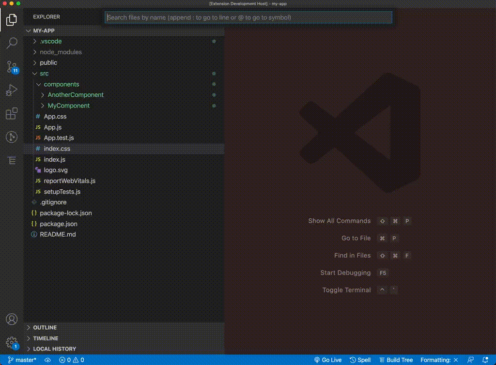

# Reactable Stateless Components

## Features

Easily create stateless react components, with seperate files for the component, container, a config and styles.

## Instructions

1) Open the command pallet by pushing `cmd p`

2) type `> Stateless Component`

3) Name your component. React Stateless component will then generate the required files for your stateless component

## Requirements

VS Code > 1.63.0

## Extension Settings

None at present

## Known Issues

Currently only works if your components are in `src/components` directory. 

## Release Notes

Users appreciate release notes as you update your extension.

### 1.0.0

Initial release of Nexus Reactable Stateless Components